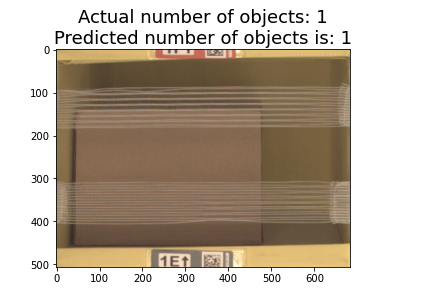

# INVENTORY MONITORING AT DISTRIBUTION CENTERS
-----------------------------------------------------------------------------------------------------

## PROJECT OVERVIEW:
-----------------------------------------------------------------------------------------------------

Distribution centers often use robots to move objects as a part of their operations. Objects are carried in bins which can contain multiple objects. 
This project builds a model that can count the number of objects in each bin. A system like this can be used to track inventory and make sure that delivery consignments have the correct number of items.

## DEPENDENCIES
-----------------------------------------------------------------------------------------------------

Python => 3.6

PyTorch => 1.8

Sagemaker => 2.86.2

Boto3 => 1.21.42

Numpy => 1.17.0

Pandas => 1.1.5

Matplotlib => 3.3.4

## DATASET OVERVIEW
-----------------------------------------------------------------------------------------------------

To build this project, we use the [Amazon Bin Images Dataset](https://registry.opendata.aws/amazon-bin-imagery/)

The original dataset contains images of bins containing upto 209 objects. For this project, only a limited set of bins containing upto `5` objects are being considered. 
Here are sample images for each class:

 **CLASS 1**
 

**CLASS 2**
     

**CLASS 3**

**CLASS 4**

**CLASS 5**

Within each class, a subset of `10000 images` of the total dataset is used.
With that the project database consists of `5` classes, each containing `8000` images for training and `2000` for testing.

A file consisting a mapping of the filenames and corresponding quantities in each image  `quantity.csv` is downloaded to the project folder from the Kaggle link [here](https://www.kaggle.com/datasets/williamhyun/amazon-bin-image-dataset-file-list)

## DATASET ACCESS
-----------------------------------------------------------------------------------------------------

The dataset is downloaded in batches per class id using the boto3 s3 client.
While downloading 80% of the data is copied to the train folder and the rest 20% to the test folder

Both Train and Test folders contain subfolders named according to the different classes (viz. 1,2,3,4,5). 
The number of objects is equal to the name of the folder. For instance, folder `1` has images with 1 object in them.

Finally this data is uploaded to an AWS S3 bucket using the aws cli cp command.
The S3 Bucket needs to be created before running the cp command.

## MACHINE LEARNING PIPELINE
-----------------------------------------------------------------------------------------------------
The major steps of the image classification pipeline are:

1. Upload Training Data: Download data from the public s3 bucket and upload the images in the folder structure fit for training to an S3 bucket.

    Folder Structure: 

            dataset-amazon:
                |
                |
                `----> train:
                |      |-----> 1
                |      |-----> 2
                |      |-----> 3
                |      |-----> 4
                |      |-----> 5
                |
                `----> test
                       |-----> 1
                       |-----> 2
                       |-----> 3
                       |-----> 4
                       |-----> 5
                       
2. Model Training Script: Write training script to create dataloaders from the above folder and running the training and testing epochs.

3. Train in SageMaker: Run training script from Step 2 using SageMaker to run that training script and train the model.

4. Establish a base line model from Step 3 and then run a Hyperparameter Tuning job to check for improvements

5. Deploy the model to an endpoint and query it using unseen images - neither test nor train(These were downloaded separately from the ABID S3 bucket)

## TRAINING RESULTS 
-----------------------------------------------------------------------------------------------------

Here are some of the optimisations attempted to improve the accuracy of the model:

| Attempt | Accuracy  | Epochs  | Learning Rate  | No Grad | Image Size Reduction | Data Augmentation | 
| :-----: | :-:       | :-:     | :-:            | :-:     | :-:                  | :-:               |
| #1      | 38%       | 5 | 0.0775 | False | No | No |
| #2      | 36%       | 10 | 0.0775 | False | No | No |
| #3      | 40%       | 5 | 0.0775 | False | No | Yes |
| #4      | 38%       | 7 | 0.0775 | False | No | Yes |
| #5      | 43%       | 5 | 0.0775 | True | Yes | Yes |
| #6      | 32%       | 5 | 0.0775 | False | Yes | Yes |
| #7      | 42%       | 5 | 0.279 | True | Yes | Yes |

## PREDICTIONS
-----------------------------------------------------------------------------------------------------

 **Running Predictions on the deployed model**
 

 **Correct Prediction Class 1**
 

 **Incorrect Prediction Class 4**
 
